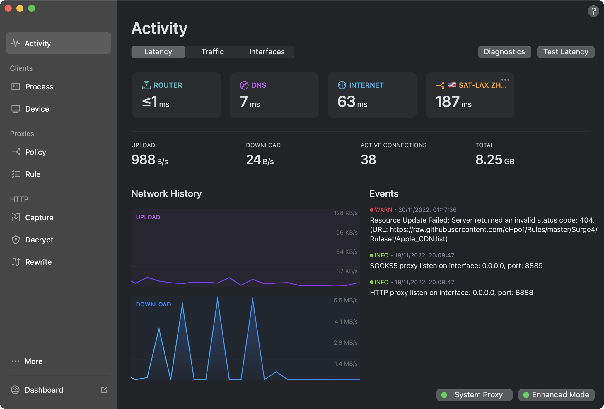
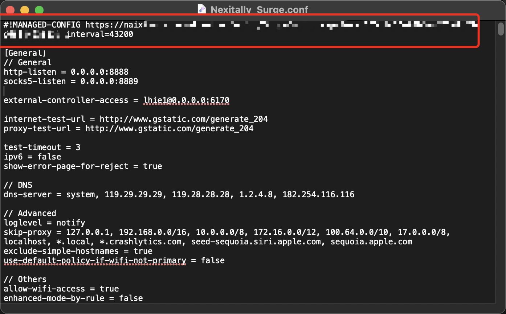
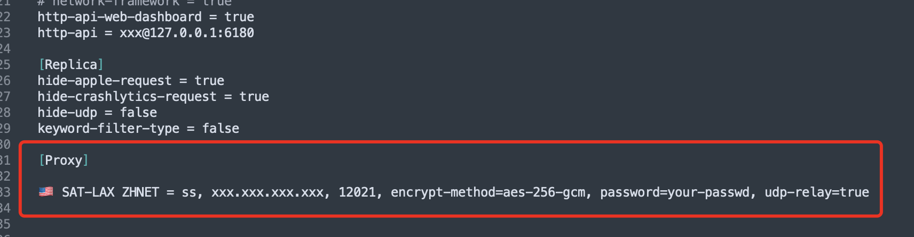
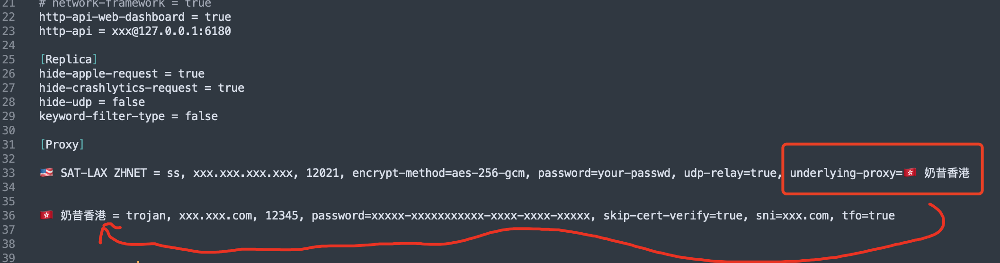

~~如何优雅的使用自己的节点~~

## 代理链(嵌套代理)的好处

 - 在几乎不影响访问速度的同时（前提是两个节点连接延迟较低），隐藏实际请求地址来增加流量通过公用节点的数据安全性
 - 可以通过自定义私有出口节点的配置来优化提高一些地区/地址的访问速度，而不用关心公共节点的具体出口策略
 - 最大化发挥出公共节点（带宽高，稳定）和私有节点（可自定义，灵活）的优势

## 原理展示

本文依旧使用 `MacOS Ventura` 为本地环境来演示，并使用Surge作为本次演示的程序

Proxy Chain:

```
+---------+      +----------+        +----------+      +--------+
|         |      |          |  Chain |          |      |        |
|  Surge  +----->+ Policy_A +------->+ Policy_B +----->+ Target |
|         |      |          |        |          |      |        |
+---------+      +----------+        +----------+      +--------+

                 (优化节点/代理) ->链路-> (自主落地)
```

Proxy Link:

```
+---------+      +----------+        +----------+      +--------+
|         |  via |          |    to  |          |      |        |
|  Surge  +----->+ Policy_A +------->+ Policy_B +----->+ Target |
|         |      |          |        |          |      |        |
+---------+      +----------+        +----------+      +--------+

                 (优化前置线路)         (自主落地)
```


## 开始配置 (Proxy Link)

首先打开我们本地的代理软件 `Surge`，



### 初始化配置文件

使用代码(文本)编辑器打开一份已激活的配置，建议选择非订阅的本地配置文件，更方便的编辑文件并可以在UI更改部分设置并不受订阅更新影响。

如何分辨该配置文件是否为 `订阅的` 配置文件？

打开一份配置文件，如文件开头有 `#!MANAGED-CONFIG https://xxxxxxxxxxxxxxxx` 字样就代表该文件是启用订阅的配置文件，您可以直接删掉开头的订阅自符，但这也将直接关闭该配置文件的订阅行为。



本文不再赘述如何提取单个文件内的代理/规则等模块。

### 设置代理链

`通过举例`简单阐述一下我们这次设置代理链实现的目的和原理：

我们现在有优秀的机场奶昔的订阅（节点），我们将通过奶昔的优化线路节点（上海 - 美国西雅图）的节点，来使用我们自有的落地节点

也就是相当于 `ProxyA via ProxyB ｜ ProxyB over ProxyA`

在Surge内，代理链的配置不算难，我们首先添加我们的落地节点：



然后我们使用 Surge 的 `underlying-proxy` 参数来设定通过哪个节点访问这个节点:



```
···
[Proxy]
···
🇺🇸 SAT-LAX ZHNET = ss, xxx.xxx.xxx.xxx, 12021, encrypt-method=aes-256-gcm, password=your-passwd, udp-relay=true, underlying-proxy=🇭🇰 奶昔香港
🇭🇰 奶昔香港 = trojan, xxx.xxx.com, 12345, password=xxxxx-xxxxxxxxxxx-xxxx-xxxx-xxxxx, skip-cert-verify=true, sni=xxx.com, tfo=true
···
```

这样就设置好代理链啦！

## 大功告成

现在 Surge 重载配置文件，选择你自己的代理链节点，在访问 [ipinfo.io](https://ipinfo.io) 就可以看到自己的IP 是你自己的自主落地啦！（当然是通过你设置的 underlying-proxy 访问的！）