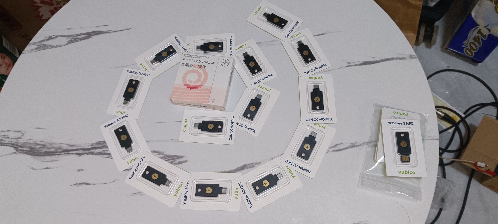
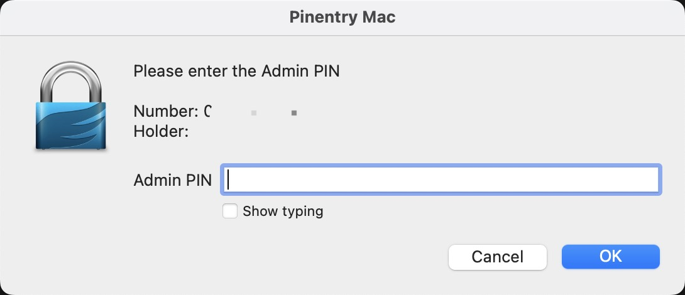
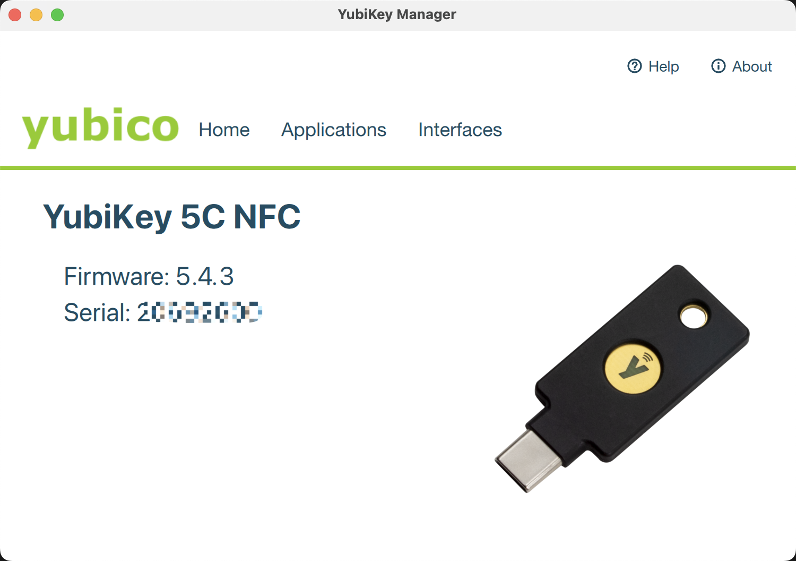

年轻人的第一个硬件密钥（本文任何演示依旧使用 ` MacOS Ventura 13.0.1` ）

# 先上图！

  

## 将自己的 PGP Key 导入

本文不再赘述如何注册PGP密钥和安装GnuPG，如您还没有PGP请自行查阅文章！

## 初始化 GPG Card

```
# GPG 编辑卡 
gpg --card-edit
```

将会弹出类似以下界面

```
Fri 11-18 16:29 HyDEV 🐱 ~
> gpg --card-edit

Reader ...........: Yubico YubiKey OTP FIDO CCID
...
卡信息(省略)
...
Signature counter : 29
KDF setting ......: off
General key info..:
pub  rsa4096/XXXXXXXXXXXXXXXX 2022-11-13 ZH (ZH FONTANA Personal identify signature) <zh.eden@icloud.com>
sec>  rsa4096/XXXXXXXXXXXXXXXX  created: 2022-11-13  expires: never
                                card-no: 0006 20692600
ssb>  rsa4096/XXXXXXXXXXXXXXXX  created: 2022-11-13  expires: never
                                card-no: 0006 20692600

#开启管理员命令
gpg/card> admin
Admin commands are allowed

#打开密码编辑
gpg/card> passwd
gpg: OpenPGP card no. XXXXXXXXXXXXXXXXXXXXXXXXX detected

1 - change PIN
2 - unblock PIN
3 - change Admin PIN
4 - set the Reset Code
Q - quit

#首先选择2解锁卡
Your selection? 2
```

Enter后会弹出一个窗口，在窗口中输入Yubikey默认的Admin Pin：

GPG Default Card:
```
Default Pin: 123456
Default Admin Pin: 12345678
```


Yubikey Manager:

```
（来自Yubikey官方网站）
Note: The default settings on the YubiKey PIV application are as follows:
PIN: 123456 (6-8 characters allowed, macOS requires numeric-only)
PUK: 12345678 (6-8 characters allowed)
Management Key: 010203040506070801020304050607080102030405060708
If you have forgotten your PIN and need to reset the PIV application to default, refer to this article.
```



输入后回提示你输入新密码并重复一遍，之后命令行中会显示
 ``` 
Your selection? 2
PIN unblocked and new PIN set.

1 - change PIN
2 - unblock PIN
3 - change Admin PIN
4 - set the Reset Code
Q - quit

Your selection? 
```

然后继续选择 3， Enter后进入同样的步骤重置 Admin PIN
全部设置完之后，我们就可以开始导入密钥啦！

## 写入到卡

来到 `gpg --edit-key "i@example.com"` 界面，这次我们直接选中下方列出的并需要导入到 card 的key
```
Fri 11-18 17:21 HyDEV 🐱 ~/Documents/GitHub/zh-blog
> gpg --edit-key "zh.eden@icloud.com"
gpg (GnuPG) 2.2.36; Copyright (C) 2022 g10 Code GmbH
This is free software: you are free to change and redistribute it.
There is NO WARRANTY, to the extent permitted by law.

Secret key is available.

sec  rsa4096/XXXXXXXXXXXXXXX
     created: 2022-11-13  expires: never       usage: SC
     card-no: XXXX XXXXXXX
     trust: ultimate      validity: ultimate
ssb  rsa4096/XXXXXXXXXXXXXXX
     created: 2022-11-13  expires: never       usage: E
     card-no: XXXX XXXXXXX
[ultimate] (1). ZH (ZH FONTANA Personal identify signature) <zh.eden@icloud.com>

gpg>
```

我们通过 `key 1` 定位到上方的子密钥（注意，注意顺序，不是每个Key都是1，如果上方有多个字密钥，请按照顺序排列）

然后上方的字密钥有 * 标记代表该密钥已被选中：

```
> gpg --edit-key "zh.eden@icloud.com"
gpg (GnuPG) 2.2.36; Copyright (C) 2022 g10 Code GmbH
This is free software: you are free to change and redistribute it.
There is NO WARRANTY, to the extent permitted by law.

Secret key is available.

sec  rsa4096/XXXXXXXXXXXXXXX
     created: 2022-11-13  expires: never       usage: SC
     card-no: XXXX XXXXXXX
     trust: ultimate      validity: ultimate
*ssb  rsa4096/XXXXXXXXXXXXXXX
     created: 2022-11-13  expires: never       usage: E
     card-no: XXXX XXXXXXX
[ultimate] (1). ZH (ZH FONTANA Personal identify signature) <zh.eden@icloud.com>

gpg>
```

然后通过 `keytocard`命令将加密密钥写入yubikey
```
gpg> key 1
gpg> keytocard
Please select where to store the key:
   (2) Encryption key
Your selection? 2
```
其次，反选加密密钥，装载认证密钥和签名密钥至 Yubikey:
```
gpg> 1
gpg> keytocard
Please select where to store the key:
   (1) Signature key
   (3) Authentication key
Your selection? 1
反选后
Your selection? 3
```
最后保存：
```
gpg> save
```
这样就大功告成啦！

## 初始化 Yubikey

首先到官网下载 [Yubikey Manager](https://www.yubico.com/support/download/yubikey-manager/)

安装完成后可能会索取一些权限或重新插拔，首页显示型号和设备编号即成功。



进入主页面后点击 `Applications -> PIV -> Configure -> PIN`
 - Current PIN：假设默认 PIN 未更改，请输入默认 PIN 123456或只需单击使用默认值。
 - New PIN：使用 6-8 位数字作为新 PIN 并记下以供将来参考。配置 macOS 登录时，请勿在 PIN 中使用字母或其他字符。macOS 不接受非数字字符。
 - Comfirm New PIN：确认在上一字段中输入的 PIN。 

单击Change PIN 以更改